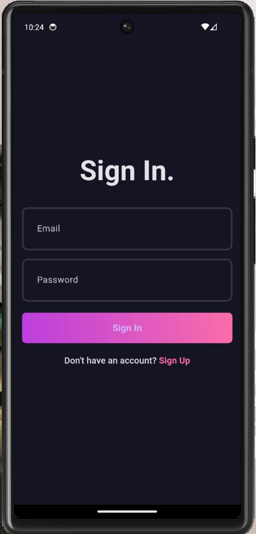
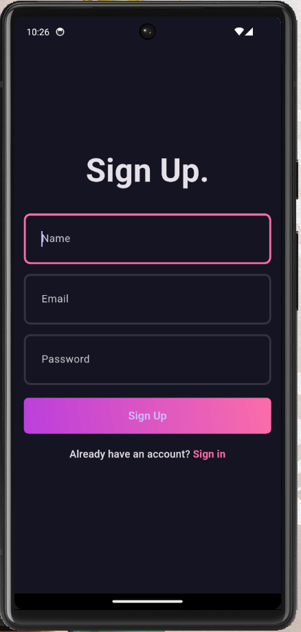
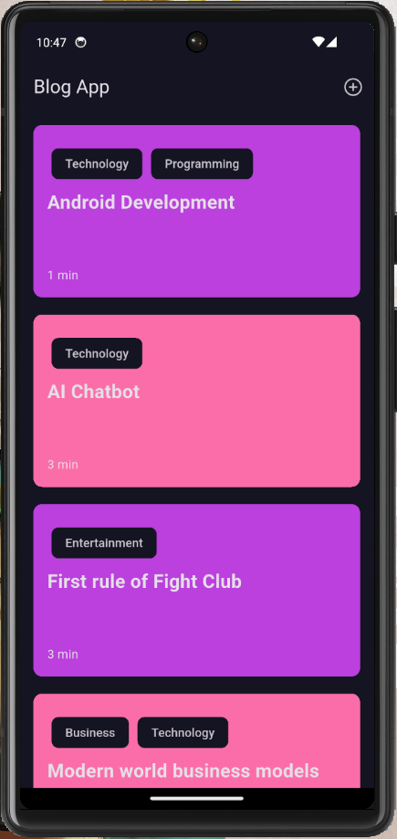
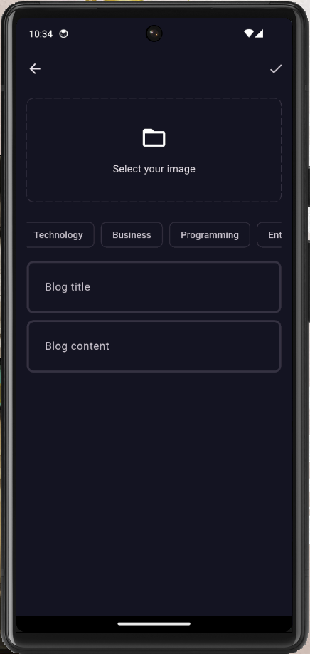
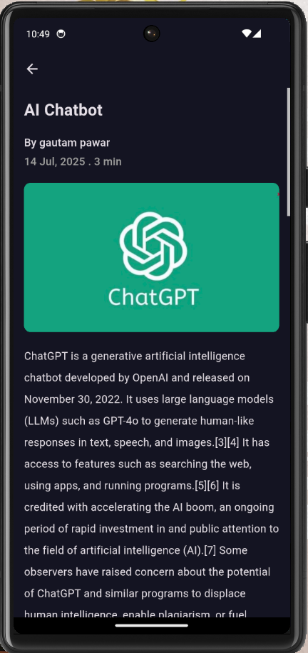

# 📝 Blog App  
A feature-rich, scalable blogging application built with **Flutter**, following **Clean Architecture** and **SOLID principles** for maintainability. Powered by **Supabase** for backend services, the app offers a seamless experience for creating, managing, and reading blogs with offline support and a modern UI.

---

## ✨ Features  

### 🔐 Authentication  
- Sign up and log in with email & password  
- Keeps users logged in for persistent sessions  

### 🏠 Home Page  
- Displays all available blogs  
- Blogs shown with topics, title, and dynamically calculated reading time  
- Offline caching for previously fetched blogs  

### ➕ Add New Blog  
- Upload blogs with title, content, and image  
- Blogs stored securely using **Supabase** backend  

### 📖 Blog Detail Page  
- Read full blog content with dynamically calculated **reading time**  

---

## 📸 Screenshots  
Screenshots of the app UI on various screens:  

### 🔐 Login & Signup  
| Login Page | Signup Page |
|------------|-------------|
|  |  |

### 🏠 Home, Add Blog & Blog Detail  
| Home Page | Add New Blog | Blog Detail |
|-----------|--------------|------------|
|  |  |  |

---

## 🧱 Tech Stack  
- **Flutter** – Cross-platform UI framework  
- **Dart** – Programming language  
- **Supabase** – Authentication, database, and storage  
- **Bloc & Cubit** – State management  
- **GetIt** – Dependency Injection  
- **Hive** – Local storage for caching blogs  
- **fpdart** – Functional programming utilities  

---
